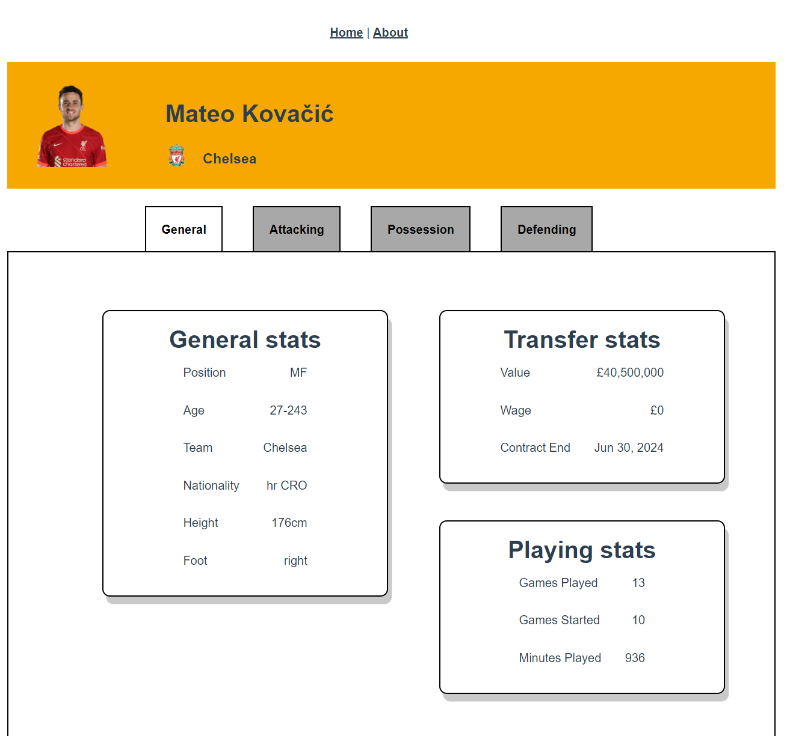
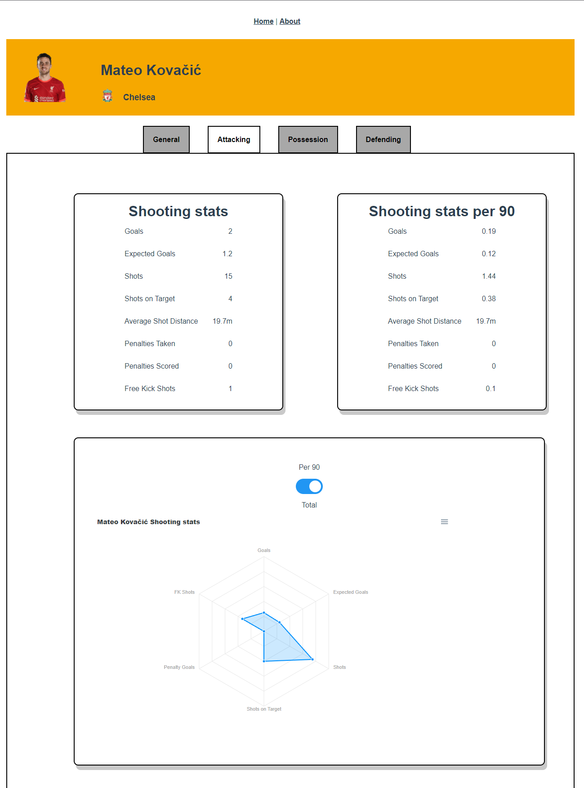

<div id="top"></div>

<!-- PROJECT SHIELDS -->


<!-- PROJECT LOGO -->
<br />
<div align="center">
  <a href="https://github.com/georgefox6/football-stats-frontend">
    
  </a>

<h3 align="center">Football Stats Frontend</h3>

  <p align="center">
    This project is to create a front end for <a href="https://github.com/georgefox6/football-stats-api"><strong>Football stats api</strong></a>. This website will provide in depth statistics for football players and teams around the world.
    <br />
    <a href="https://github.com/georgefox6/football-stats-frontend"><strong>Explore the docs »</strong></a>
    <br />
    <br />
    <a href="https://github.com/georgefox6/football-stats-frontend">View Demo</a>
    ·
    <a href="https://github.com/georgefox6/football-stats-frontend/issues">Report Bug</a>
    ·
    <a href="https://github.com/georgefox6/football-stats-frontend/issues">Request Feature</a>
  </p>
</div>


<!-- TABLE OF CONTENTS -->
<details>
  <summary>Table of Contents</summary>
  <ol>
    <li>
      <a href="#about-the-project">About The Project</a>
      <ul>
        <li><a href="#built-with">Built With</a></li>
      </ul>
    </li>
    <li>
      <a href="#getting-started">Getting Started</a>
      <ul>
        <li><a href="#prerequisites">Prerequisites</a></li>
        <li><a href="#installation">Installation</a></li>
      </ul>
    </li>
    <li><a href="#usage">Usage</a></li>
    <li><a href="#roadmap">Roadmap</a></li>
    <li><a href="#contributing">Contributing</a></li>
    <li><a href="#license">License</a></li>
    <li><a href="#contact">Contact</a></li>
    <li><a href="#acknowledgments">Acknowledgments</a></li>
  </ol>
</details>


<!-- ABOUT THE PROJECT -->
## About The Project

This project is to create a front end for <a href="https://github.com/georgefox6/football-stats-api"><strong>Football stats api</strong></a>. This website will provide in depth statistics for football players and teams around the world.

<p align="right">(<a href="#top">back to top</a>)</p>

### Contributors

<a href="https://github.com/georgefox6/football-stats-frontend/graphs/contributors">
  
</a>


### Built With

* [Vue js#](https://vuejs.org)
* [babel](https://github.com/vuejs/vue-cli/tree/dev/packages/%40vue/cli-plugin-babel)
* [Router](https://github.com/vuejs/vue-cli/tree/dev/packages/%40vue/cli-plugin-router)
* [Vuex](https://github.com/vuejs/vue-cli/tree/dev/packages/%40vue/cli-plugin-vuex)
* [ESlint](https://github.com/vuejs/vue-cli/tree/dev/packages/%40vue/cli-plugin-eslint)
* [Unit Jest](https://github.com/vuejs/vue-cli/tree/dev/packages/%40vue/cli-plugin-unit-jest)
* [E2E Cypress](https://github.com/vuejs/vue-cli/tree/dev/packages/%40vue/cli-plugin-e2e-cypress)

<p align="right">(<a href="#top">back to top</a>)</p>

<!-- GETTING STARTED -->
## Getting Started

This project is hosted on azure but you can also run it locally following the instructions below.

### Prerequisites

* Node js
  
  Download <a href="https://nodejs.org/en/download/">Node js </a> by following <a href="https://docs.npmjs.com/downloading-and-installing-node-js-and-npm"> this guide.</a>

* Vue js
  
  ```sh
    npm install vue
  ```


### Installation

```sh
git clone https://github.com/georgefox6/football-stats-frontend.git
```

```
npm install
```

### Compiles and hot-reloads for development

```
npm run serve
```

### Compiles and minifies for production

```
npm run build
```

### Run your unit tests

```
npm run test:unit
```

### Run your end-to-end tests

```
npm run test:e2e
```

### Lints and fixes files

```
npm run lint
```


<p align="right">(<a href="#top">back to top</a>)</p>


<!-- USAGE EXAMPLES -->
## Usage

<p>Here are some examples of the API calls to retrieve specific players. </p>




<p>TODO include some code examples and demos</p>

<p align="right">(<a href="#top">back to top</a>)</p>


<!-- ROADMAP -->
## Roadmap

- [] Add possession stats to player screen
- [] Add defending stats to player screen
- [] Deploy to Azure
    - [] Add a custom domain
- [] Add football club data 
- [] Use real photos of players and club badges instead of dummy data

See the [open issues](https://github.com/georgefox6/football-stats-frontend/issues) for a full list of proposed features (and known issues).

<p align="right">(<a href="#top">back to top</a>)</p>


<!-- CONTRIBUTING -->
## Contributing

Contributions are what make the open source community such an amazing place to learn, inspire, and create. Any contributions you make are **greatly appreciated**.

If you have a suggestion that would make this better, please fork the repo and create a pull request. You can also simply open an issue with the tag "enhancement".
Don't forget to give the project a star! Thanks again!

1. Fork the Project
2. Create your Feature Branch (`git checkout -b feature/AmazingFeature`)
3. Commit your Changes (`git commit -m 'Add some AmazingFeature'`)
4. Push to the Branch (`git push origin feature/AmazingFeature`)
5. Open a Pull Request

<p align="right">(<a href="#top">back to top</a>)</p>


<!-- LICENSE -->
## License

Distributed under the MIT License. See `LICENSE.txt` for more information.

<p align="right">(<a href="#top">back to top</a>)</p>


<!-- CONTACT -->
## Contact

George Fox - Georgefox1996@gmail.com

Project Link: [https://github.com/georgefox6/football-stats-frontend](https://github.com/georgefox6/football-stats-frontend)

<p align="right">(<a href="#top">back to top</a>)</p>


<!-- ACKNOWLEDGMENTS -->
## Acknowledgments

* []()
* []()
* []()

<p align="right">(<a href="#top">back to top</a>)</p>
